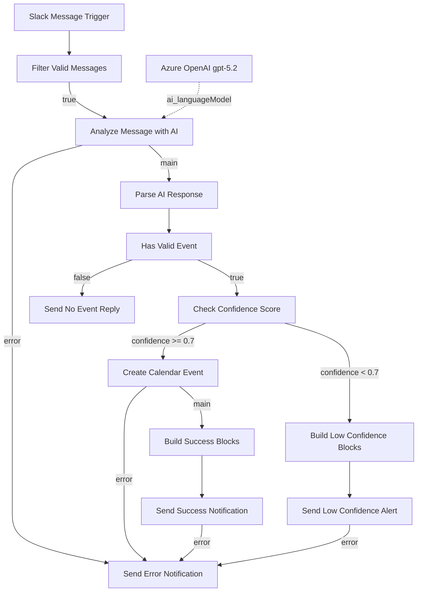

# Slack to Google Calendar AI Assistant — Implementation Guide

> **Reference snapshot**: `Slack_to_Google_Calendar_AI_Assistant.json` (workflow id `I2dch7ZKvBvX6GVC`).
> This document is verified against that export, so if the two disagree, the export wins.
> Operationally the live n8n instance is the source of truth — change the workflow there, then sync
> the export back into this repository. Every node name, version, and parameter below was read from
> that file.

繁體中文版本：[README.zh-tw.md](./README.zh-tw.md)

## 📋 System Overview

An n8n workflow that turns Slack messages into Google Calendar events:

- Listens to a single Slack channel (`C08NVUQUK8F`)
- Sends qualifying messages to Azure OpenAI for schedule extraction
- Parses the model's JSON, normalises dates, and scores confidence
- Creates the calendar event only when confidence ≥ 0.7
- Replies in Slack with one of four outcomes for every message that passes the filter: success, low
  confidence, no event, and error. Messages rejected by the filter get no reply at all.

Status: **active**. Fixed notification copy is Traditional Chinese (zh-TW); dynamic content — event
titles, the original Slack message, model reasoning — keeps whatever language it arrived in. Node
names are English.

## 🏗️ System Architecture

14 nodes. `Azure OpenAI gpt-5.2` is an AI sub-node attached to the chain over the
`ai_languageModel` port, not a step in the main path.



The `false` branch of `Filter Valid Messages` is intentionally unconnected — messages that fail
the filter end the execution silently, with no Slack reply.

## 🔧 Node Configuration Details

### 1. Slack Message Trigger

**Type**: `n8n-nodes-base.slackTrigger` v1 · **Credential**: `slackApi` — "Slack account"

```yaml
trigger: [message]
channelId:
  __rl: true
  mode: id
  value: C08NVUQUK8F
options: {}
```

Fires on every message in the channel, including the bot's own replies — those are removed by the
next node, not here.

### 2. Filter Valid Messages

**Type**: `n8n-nodes-base.if` v2.3 · Combinator: `and` · 5 conditions, all must pass

| id | Left | Operation | Right | Purpose |
|---|---|---|---|---|
| `cond-channel` | `{{ $json.channel }}` | string contains | `C08NVUQUK8F` | second channel guard |
| `cond-type` | `{{ $json.type }}` | string equals | `message` | ignore non-message events |
| `cond-bot` | `{{ $json.bot_id }}` | string empty | — | **breaks the bot feedback loop** |
| `cond-subtype` | `{{ $json.subtype }}` | string empty | — | ignore joins, edits, deletes |
| `cond-thread` | `{{ $json.thread_ts }}` | string empty | — | ignore thread replies |

```yaml
options:
  caseSensitive: true
  typeValidation: loose
  version: 2
```

`cond-bot` is what stops the workflow re-triggering on its own notifications. Do not remove it.

### 3. Analyze Message with AI

**Type**: `@n8n/n8n-nodes-langchain.chainLlm` v1.9 · `onError: continueErrorOutput`

```yaml
promptType: define
text: "={{ $json.text }}"          # the Slack message body
messages.messageValues[0].message: <system prompt, ~1,860 chars>
```

The system prompt (zh-TW) instructs the model to:

- Produce **one primary event** per analysis, merging related activities into one description
- Return `hasEvent: false` for greetings, small talk, weather, recommendations — when unsure, prefer `false`
- Detect locations after movement verbs (去/到/往/赴/前往/出發到/飛往) and positional prepositions (在/於/位於)
- Classify all-day vs timed events (travel, day trips, business trips, leave, festivals, workshops, multi-location itineraries → all-day)
- Anchor "now" with `{{ DateTime.now().setZone('Asia/Taipei').toFormat('yyyy年MM月dd日 (cccc)', { locale: 'zh-TW' }) }}`
- Infer the year: past month → next year, current month or later → this year
- Keep `attendees` an **empty array** so Google Calendar sends no invitations; attendee info goes into the description
- Score confidence: 0.9+ full detail, 0.7–0.9 clear time and place, 0.5–0.7 partial, <0.5 lacking

Required output shape:

```json
{
  "hasEvent": true,
  "events": [
    {
      "title": "活動標題",
      "description": "詳細描述",
      "startDateTime": "YYYY-MM-DD 或 YYYY-MM-DDTHH:mm:ss+08:00",
      "endDateTime": "同上",
      "isAllDay": true,
      "location": "地點",
      "attendees": [],
      "confidence": 0.95
    }
  ],
  "reasoning": "分析原因"
}
```

When there is no event: `{ "hasEvent": false, "events": [], "reasoning": "..." }`.

### 4. Azure OpenAI gpt-5.2

**Type**: `@n8n/n8n-nodes-langchain.lmChatAzureOpenAi` v1 · **Credential**:
`azureEntraCognitiveServicesOAuth2Api` — "Azure Open AI account Entra ID"

```yaml
authentication: azureEntraCognitiveServicesOAuth2Api
model: gpt-5.2
options: {}
```

Connected to node 3 through the `ai_languageModel` port. It has no `main` connections and no error
output — a model failure surfaces on the chain node's error output.

### 5. Parse AI Response

**Type**: `n8n-nodes-base.code` v2 · `mode: runOnceForAllItems`

The workflow's normalisation layer. Expected failures — missing input, unparseable JSON, bad dates —
are converted into an item carrying a `status` field so downstream IF nodes can route them. It is
not exception-proof: `aiOutput.hasEvent` is read outside any `try`, so a model reply that parses to
valid JSON `null` still fails the node with no Slack reply.

1. Guards missing input and missing model output → `status: 'error'`
2. Strips code fences (` ```json `) before `JSON.parse`, because the model does not always comply
3. Reads the original Slack payload via `$('Slack Message Trigger').first().json`, with a fallback
4. Returns `status: 'no_event'` when `hasEvent` is false or `events` is empty
5. Per event:
   - Skips events missing `title` or `startDateTime` (returns `null`, filtered out afterwards)
   - All-day when `isAllDay === true` or neither date contains `T`; the normalised `startDateTime`
     (not the end) is validated against `^\d{4}-\d{2}-\d{2}$`
   - Timed events are parsed with `new Date()`; if `end <= start`, end is pushed to start + 1 hour.
     Both are emitted as UTC ISO strings via `toISOString()` — the workflow timezone converts them back
   - On any date failure, falls back to tomorrow as an all-day event
   - Filters `attendees` to values containing `@` and `.`
   - Builds the description with a `📋 來源信息：` block (original message, sender, channel, event type, confidence, reasoning)
   - Sets `status` to `high_confidence` when `confidence >= 0.7`, otherwise `low_confidence`
6. Returns `status: 'no_event'` if every event was rejected
7. A `try/catch` around event processing converts unexpected failures **inside that block** into
   `status: 'error'`

Output fields emitted: `eventIndex`, `title`, `description`, `startDateTime`, `endDateTime`,
`isAllDay`, `location`, `attendees`, `confidence`, `confidenceDisplay`, `reasoning`,
`originalMessage`, `slackUser`, `slackChannel`, `slackTimestamp`, `status`.

Not everything emitted is consumed. `attendees` is computed and filtered but **never mapped into
`Create Calendar Event`**, and `eventIndex` / `originalMessage` / `slackUser` / `slackChannel` /
`slackTimestamp` are carried for context only. See the data contract table for what is actually read.

### 6. Has Valid Event

**Type**: `n8n-nodes-base.if` v2.3 · Combinator: `and`

| Left | Operation | Right |
|---|---|---|
| `{{ $json.status }}` | string notEquals | `no_event` |
| `{{ $json.status }}` | string notEquals | `error` |

`false` → `Send No Event Reply`, which handles **both** the `no_event` and `error` cases.

### 7. Check Confidence Score

**Type**: `n8n-nodes-base.if` v2.3 · `alwaysOutputData: false`

```yaml
leftValue: "={{ $json.confidence }}"
operator: { type: number, operation: gte }
rightValue: 0.7
```

⚠️ **The 0.7 threshold exists in two places** — here, and in the ternary that sets `status` in
`Parse AI Response`. Change both together or the reported status and the actual routing disagree.

### 8. Create Calendar Event

**Type**: `n8n-nodes-base.googleCalendar` v1.3 · `onError: continueErrorOutput` ·
**Credential**: `googleCalendarOAuth2Api` — "Google Calendar account"

```yaml
operation: create
calendar: { __rl: true, mode: list, value: abc12207@gmail.com }
start: "={{$json.startDateTime}}"
end:   "={{$json.endDateTime}}"
additionalFields:
  summary:      "={{$json.title}}"
  description:  "={{$json.description}}"
  location:     "={{$json.location}}"
  allday:       "={{ $json.isAllDay ? 'yes' : 'no' }}"
  maxAttendees: 50
  sendUpdates:  none
```

`sendUpdates: none` means **no invitation emails are sent**. Note that `attendees` is not part of
this parameter set at all — the field computed by `Parse AI Response` is never mapped here, so the
event is always created without guests regardless of what the model returns. All-day events are
driven by the `allday` ternary — the value must be the string `'yes'`/`'no'`, not a boolean.

### 9. Build Success Blocks

**Type**: `n8n-nodes-base.code` v2 — reads the Google Calendar API response.

- `data.start.date` → all-day, formatted `MM月dd日 (cccc)`
- `data.start.dateTime` → timed, both ends converted with `DateTime.fromISO(...).setZone('Asia/Taipei')`, formatted `MM月dd日 (cccc) HH:mm - HH:mm`
- Description preview is the text before the `📋 來源信息：` marker
- Emits header / section / fields / divider / actions (a `📎 查看事件` button linking `data.htmlLink`) / context blocks

Returns `{ blocks: JSON.stringify(blocks), fallbackText }` — the blocks must be a **string**.

### 10. Send Success Notification

**Type**: `n8n-nodes-base.slack` v2.4 · `onError: continueErrorOutput`

```yaml
resource: message
operation: post
select: channel
channelId: { __rl: true, mode: id, value: C08NVUQUK8F }
messageType: block
blocksUi: "={{ $json.blocks }}"
text:     "={{ $json.fallbackText }}"
```

### 11. Build Low Confidence Blocks

**Type**: `n8n-nodes-base.code` v2 — builds an advisory message from `Parse AI Response` output
(title, `startDateTime` as-is, location, `confidenceDisplay`, `reasoning`) and closes with a hint to
resend with explicit time and place. Same `{ blocks: JSON.stringify(...), fallbackText }` contract.

No calendar event is created on this path.

### 12. Send Low Confidence Alert

**Type**: `n8n-nodes-base.slack` v2.4 · `onError: continueErrorOutput` — identical configuration to
node 10.

### 13. Send No Event Reply

**Type**: `n8n-nodes-base.slack` v2.4 · `messageType: text`

A single expression covers both cases it receives:

```javascript
{{ $json.status === 'error'
   ? '❌ 處理訊息時發生錯誤 …' + ($json.error || '未知錯誤') + '…'
   : 'ℹ️ 此訊息未包含可辨識的日程資訊，未建立日曆事件。…' + ($json.reasoning || '無') + '…' }}
```

### 14. Send Error Notification

**Type**: `n8n-nodes-base.slack` v2.4 · `messageType: text` — the shared error sink.

```javascript
{{ $json.error && $json.error.message ? $json.error.message : ($json.message || '未知錯誤') }}
```

Note the `&&` guard instead of `?.`: this is an n8n expression, not Code node JavaScript.

## 🔗 Data Contract Between Nodes

| Producer | Consumer | Fields the consumer relies on |
|---|---|---|
| Slack Message Trigger | Filter Valid Messages | `channel`, `type`, `bot_id`, `subtype`, `thread_ts` |
| Slack Message Trigger | Parse AI Response (backwards reference) | `text`, `user`, `channel`, `ts` |
| Analyze Message with AI | Parse AI Response | `text` or `output` — the raw model string |
| Parse AI Response | Has Valid Event | `status` |
| Parse AI Response | Check Confidence Score | `confidence` (number) |
| Parse AI Response | Create Calendar Event | `startDateTime`, `endDateTime`, `isAllDay`, `title`, `description`, `location` |
| Parse AI Response | Build Low Confidence Blocks | `title`, `startDateTime`, `location`, `confidenceDisplay`, `reasoning` |
| Parse AI Response | Send No Event Reply | `status`, `error`, `reasoning` |
| Create Calendar Event | Build Success Blocks | `summary`, `start`, `end`, `location`, `description`, `htmlLink`, `id` |
| Build Success Blocks · Build Low Confidence Blocks | their Slack senders | `blocks` (stringified JSON), `fallbackText` |
| any error output | Send Error Notification | `error.message` or `message` |

`Parse AI Response` is the **only** node that reaches backwards by node name
(`$('Slack Message Trigger')`) — it is the single such reference in the whole export. That name is
therefore a hard dependency: after renaming the trigger, re-check this Code node and update the
string if it was not rewritten for you.

## 🔀 Routing and Error Handling

Four nodes set `onError: "continueErrorOutput"` and route their **second** `main` output (index 1)
into `Send Error Notification`:

| Node | Why it can fail |
|---|---|
| `Analyze Message with AI` | model or API timeout, authentication failure, quota exhaustion |
| `Create Calendar Event` | OAuth expiry, invalid date range, calendar permissions |
| `Send Success Notification` | Slack rate limit, invalid Block Kit payload |
| `Send Low Confidence Alert` | same as above |

A malformed model reply does **not** take this route. It is caught in `Parse AI Response`, becomes
`status: 'error'`, and reaches Slack through `Send No Event Reply` instead.

`Send No Event Reply` and `Azure OpenAI gpt-5.2` deliberately have no error output. When adding a
fallible node to the main path, wire its error output to the same sink.

## ⚙️ Workflow Settings

```yaml
executionOrder: v1
timezone: Asia/Taipei
executionTimeout: 3600
saveExecutionProgress: true
saveManualExecutions: true
saveDataErrorExecution: all
saveDataSuccessExecution: all
binaryMode: separate
callerPolicy: workflowsFromSameOwner
availableInMCP: false
```

This is the only workflow in the repository carrying a full settings block; copy it when creating a
new workflow rather than retyping it.

## 🔐 Credential Configuration

| Credential type | Name in n8n | Used by |
|---|---|---|
| `slackApi` | Slack account | trigger + all 4 Slack senders |
| `azureEntraCognitiveServicesOAuth2Api` | Azure Open AI account Entra ID | Azure OpenAI gpt-5.2 |
| `googleCalendarOAuth2Api` | Google Calendar account | Create Calendar Event |

The workflow JSON stores only `{ id, name }` references — secrets live in n8n and must never be
committed. Azure OpenAI uses Entra ID (OAuth2), not an API key.

**Slack token**: https://api.slack.com/apps → your app → OAuth & Permissions → Bot User OAuth Token.
**Google Calendar**: complete the OAuth2 flow in n8n's credential editor.

## 🔧 Slack App Configuration

The workflow uses the **Slack Trigger node**, which is served as an n8n webhook — the node carries a
`webhookId`. Copy its production Webhook URL from the n8n editor into the Slack app's
**Event Subscriptions → Request URL**, then subscribe to `message.channels`.

```yaml
Bot Token Scopes (required):
  - channels:read
  - channels:history
  - chat:write
  - users:read

Optional:
  - chat:write.public
  - reactions:read
```

> The scopes above are operational Slack app setup. They are **not** stored in the workflow export,
> so they cannot be verified against the JSON — treat them as a deployment checklist.

The bot must be a member of `C08NVUQUK8F` to receive messages and post replies.

## 🧪 Test Cases

Post these in the monitored channel and check the execution log.

| Input (zh-TW) | Expected path | Expected result |
|---|---|---|
| `5/20 去名古屋玩` | high confidence | all-day event, `startDateTime` = `YYYY-05-20` (year inferred), location 名古屋, `📎 查看事件` button |
| `明天下午 2 點團隊會議` | high confidence | timed event; the exact end time is whatever the model returns, and `Parse AI Response` only forces start + 1 h when `end <= start` |
| `可能會有個會議` | low confidence *or* `no_event` | no calendar event; the prompt tells the model to prefer `hasEvent: false` when unsure, so either reply is correct |
| `今天天氣真好` | `no_event` | `ℹ️ 此訊息未包含可辨識的日程資訊` reply |
| any message from the bot itself | filtered out | execution starts and stops at `Filter Valid Messages`; no reply |
| a thread reply | filtered out | execution starts and stops at `Filter Valid Messages`; no reply |

Rows above depend on model output, so treat them as expected behaviour to check rather than
guarantees. Year inference follows the prompt rule: a month already past resolves to next year.

⚠️ The prompt tells the model to use the **same** date for an all-day start and end, and
`Create Calendar Event` passes both through untouched. Google Calendar treats the all-day `end`
date as exclusive, so verify against a real execution whether an all-day event lands on the
intended day before trusting this path.

## 🚨 Known Behaviours and Gotchas

1. **Bot feedback loop** — prevented by `cond-bot` (`bot_id` empty) in `Filter Valid Messages`.
   Removing it makes every notification retrigger the workflow.
2. **All-day flag** — `additionalFields.allday` must receive `'yes'`/`'no'` strings. A correct
   all-day event comes back from Google as `"start": { "date": "YYYY-MM-DD" }`; if you see
   `"start": { "dateTime": ... }` the flag did not take effect.
3. **Confidence is a float** — `Parse AI Response` runs `parseFloat(event.confidence) || 0.5` so the
   value reaching the IF node is already numeric. The IF node also runs `typeValidation: loose`, so
   do not rely on coercion; keep the explicit `parseFloat`.
4. **Block Kit must be stringified** — `blocksUi` receives `JSON.stringify(blocks)`. Every Block Kit
   message in this repository uses that form.
5. **No invitations are sent** — `sendUpdates: none`, and `attendees` is never mapped into
   `Create Calendar Event` at all. Attendee information appears only in the event description.
   (`CHANGELOG.md` 1.0.3 claims `sendUpdates: all` and configured reminders; the JSON has neither.)
6. **Filter failures are silent** — the execution runs but stops at `Filter Valid Messages`, and no
   Slack reply is sent.
7. **Expression style** — this workflow writes `$json.a && $json.a.b` in expressions rather than
   `?.`. Keep that style for consistency. Code nodes are plain JavaScript and use `?.` freely.

## 🔍 Troubleshooting

| Symptom | Where to look |
|---|---|
| No execution at all | Slack trigger credential; the Request URL registered in Slack Event Subscriptions; bot membership in the channel; whether the workflow is active |
| Execution starts then stops immediately | `Filter Valid Messages` — one of the five conditions rejected the message |
| Execution stops after the AI node | `Analyze Message with AI` error output → check the Slack error message |
| `AI 回應解析失敗` | Ordinary ` ```json ` fences are stripped before parsing, so this means invalid JSON or surrounding prose — inspect `rawResponse`. It surfaces through `Send No Event Reply`, not the AI node's error output |
| Event created at the wrong time | `Parse AI Response` date branch; confirm workflow timezone is `Asia/Taipei` |
| Low confidence alert when it should succeed | Compare `confidence` in the item against both threshold locations |
| Slack message posts as raw JSON | `messageType` is `text` while blocks were supplied, or `blocksUi` got an array instead of a string |

`console.log` output from Code nodes appears in the n8n execution log; all existing logs are zh-TW
with emoji prefixes (`❌`, `⚠️`, `✅`, `📅`, `ℹ️`).

## 📝 Maintenance Notes

- Validate with `n8n_validate_workflow` (`profile: strict`) after every change, then sync the cloud
  copy back to this JSON file. The n8n instance is the source of truth.
- When the prompt's JSON shape changes, update `Parse AI Response`, both IF nodes, and both block
  builders in the same change.
- Node versions in use: slackTrigger 1 · if 2.3 · chainLlm 1.9 · lmChatAzureOpenAi 1 · code 2 ·
  googleCalendar 1.3 · slack 2.4.
- The channel id `C08NVUQUK8F` is hard-coded in **six** places: the trigger, the `cond-channel`
  filter condition, and all four Slack senders (`Send Success Notification`,
  `Send Low Confidence Alert`, `Send No Event Reply`, `Send Error Notification`). Changing channels
  means changing all of them.
- Repository conventions live in `.github/copilot-instructions.md`.

## 🆕 Possible Extensions (not implemented)

- Meeting-room booking lookup before event creation
- Real attendee resolution from Slack user ids — requires mapping `attendees` into
  `Create Calendar Event` (it is currently computed but unused) and re-enabling `sendUpdates`
- Interactive Slack buttons to confirm or discard low-confidence events
- Recurring event support (the prompt currently produces a single event per message)
