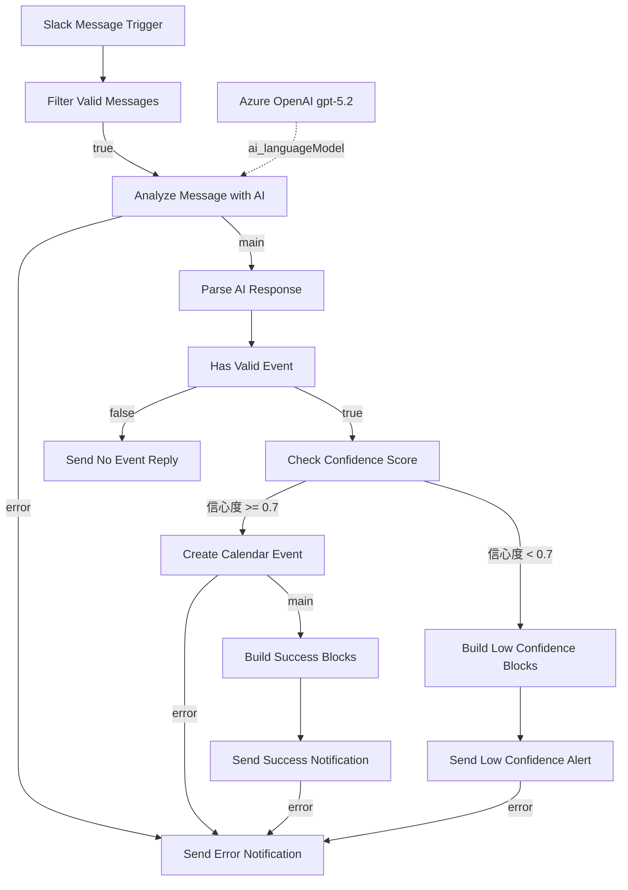

# Slack to Google Calendar AI Assistant — 實作說明

> **參考快照**：`Slack_to_Google_Calendar_AI_Assistant.json`（工作流程 id `I2dch7ZKvBvX6GVC`）。
> 本文件是對照該匯出檔驗證的，因此兩者不一致時以匯出檔為準。
> 但就維運而言，正在運行的 n8n 實例才是事實來源——請在實例上修改，再把匯出檔同步回本 repo。
> 以下所有節點名稱、版本與參數皆直接讀自該檔案。

English version: [README.md](./README.md)

## 📋 系統概覽

將 Slack 訊息轉換為 Google Calendar 事件的 n8n 工作流程：

- 監聽單一 Slack 頻道（`C08NVUQUK8F`）
- 將符合條件的訊息送交 Azure OpenAI 擷取日程資訊
- 解析模型回傳的 JSON、正規化日期並評估信心度
- 僅在信心度 ≥ 0.7 時建立日曆事件
- 通過過濾的訊息，一律會依四種結果之一回覆 Slack：成功、低信心度、無事件、錯誤。
  被過濾掉的訊息則完全不會收到回覆

狀態：**已啟用（active）**。固定的通知文案為正體中文；動態內容——活動標題、原始 Slack 訊息、
模型分析說明——維持其原本語言。節點名稱使用英文。

## 🏗️ 系統架構

共 14 個節點。`Azure OpenAI gpt-5.2` 是透過 `ai_languageModel` 連接埠掛在 chain 節點上的 AI 子節點，
不在主流程路徑上。



`Filter Valid Messages` 的 `false` 分支刻意未連接——未通過過濾的訊息會靜默結束執行，不會回覆 Slack。

## 🔧 節點設定細節

### 1. Slack Message Trigger

**類型**：`n8n-nodes-base.slackTrigger` v1 · **憑證**：`slackApi` —「Slack account」

```yaml
trigger: [message]
channelId:
  __rl: true
  mode: id
  value: C08NVUQUK8F
options: {}
```

頻道內每則訊息都會觸發，包含機器人自己發出的回覆——這些訊息由下一個節點濾除，而非在此處理。

### 2. Filter Valid Messages

**類型**：`n8n-nodes-base.if` v2.3 · 組合方式：`and` · 5 個條件全部必須成立

| id | 左值 | 運算 | 右值 | 用途 |
|---|---|---|---|---|
| `cond-channel` | `{{ $json.channel }}` | string contains | `C08NVUQUK8F` | 第二道頻道防護 |
| `cond-type` | `{{ $json.type }}` | string equals | `message` | 排除非訊息事件 |
| `cond-bot` | `{{ $json.bot_id }}` | string empty | — | **阻斷機器人無限迴圈** |
| `cond-subtype` | `{{ $json.subtype }}` | string empty | — | 排除加入、編輯、刪除等事件 |
| `cond-thread` | `{{ $json.thread_ts }}` | string empty | — | 排除討論串回覆 |

```yaml
options:
  caseSensitive: true
  typeValidation: loose
  version: 2
```

`cond-bot` 是防止工作流程被自己的通知重複觸發的關鍵，請勿移除。

### 3. Analyze Message with AI

**類型**：`@n8n/n8n-nodes-langchain.chainLlm` v1.9 · `onError: continueErrorOutput`

```yaml
promptType: define
text: "={{ $json.text }}"          # Slack 訊息內文
messages.messageValues[0].message: <系統提示詞，約 1,860 字元>
```

系統提示詞（正體中文）要求模型：

- 每次分析只產生**一個主要事件**，相關活動合併寫入描述
- 問候、閒聊、天氣、推薦等內容一律回傳 `hasEvent: false`；不確定時傾向 `false`
- 辨識移動動詞（去／到／往／赴／前往／出發到／飛往）與位置介詞（在／於／位於）後的地點
- 判斷全天或定時活動（旅遊、一日遊、出差、請假、節日、工作坊、多地點行程 → 全天）
- 以 `{{ DateTime.now().setZone('Asia/Taipei').toFormat('yyyy年MM月dd日 (cccc)', { locale: 'zh-TW' }) }}` 錨定「現在」
- 推斷年份：月份已過 → 明年；當月或之後 → 今年
- `attendees` 一律保持**空陣列**，避免 Google Calendar 寄送邀請；與會者資訊寫進描述
- 信心度評分：0.9+ 資訊完整、0.7–0.9 時間地點明確、0.5–0.7 部分明確、<0.5 資訊不足

要求的輸出格式：

```json
{
  "hasEvent": true,
  "events": [
    {
      "title": "活動標題",
      "description": "詳細描述",
      "startDateTime": "YYYY-MM-DD 或 YYYY-MM-DDTHH:mm:ss+08:00",
      "endDateTime": "同上",
      "isAllDay": true,
      "location": "地點",
      "attendees": [],
      "confidence": 0.95
    }
  ],
  "reasoning": "分析原因"
}
```

無事件時：`{ "hasEvent": false, "events": [], "reasoning": "..." }`。

### 4. Azure OpenAI gpt-5.2

**類型**：`@n8n/n8n-nodes-langchain.lmChatAzureOpenAi` v1 · **憑證**：
`azureEntraCognitiveServicesOAuth2Api` —「Azure Open AI account Entra ID」

```yaml
authentication: azureEntraCognitiveServicesOAuth2Api
model: gpt-5.2
options: {}
```

透過 `ai_languageModel` 連接埠掛在節點 3 上。它沒有 `main` 連線也沒有錯誤輸出——模型失敗會顯示在
chain 節點的錯誤輸出。

### 5. Parse AI Response

**類型**：`n8n-nodes-base.code` v2 · `mode: runOnceForAllItems`

整個流程的正規化層。可預期的失敗——沒有輸入、JSON 無法解析、日期格式錯誤——都會被轉成帶
`status` 欄位的項目，供下游 IF 節點分流。但它**並非完全不會拋錯**：`aiOutput.hasEvent` 的讀取位於
所有 `try` 之外，因此模型若回傳可被解析的 JSON `null`，此節點仍會失敗且不會有任何 Slack 回覆。

1. 防護「無輸入資料」與「模型無輸出」→ `status: 'error'`
2. 在 `JSON.parse` 前剝除程式碼圍籬（` ```json `），因為模型不一定會遵守指示
3. 以 `$('Slack Message Trigger').first().json` 取得原始 Slack 內容，並有備援值
4. `hasEvent` 為 false 或 `events` 為空時回傳 `status: 'no_event'`
5. 逐一處理事件：
   - 缺少 `title` 或 `startDateTime` 的事件直接跳過（回傳 `null`，之後被濾除）
   - `isAllDay === true` 或兩個日期都不含 `T` 即視為全天；只有正規化後的 `startDateTime`
     （不含結束日）會以 `^\d{4}-\d{2}-\d{2}$` 驗證
   - 定時活動以 `new Date()` 解析；若 `end <= start`，結束時間改為開始時間 + 1 小時。
     兩者最後透過 `toISOString()` 輸出為 UTC ISO 字串——由工作流程時區換算回台北時間
   - 日期處理失敗時，退回「明天的全天活動」
   - `attendees` 只保留同時含 `@` 與 `.` 的值
   - 描述中組出 `📋 來源信息：` 區塊（原始訊息、發送者、頻道、活動類型、信心度、分析說明）
   - `confidence >= 0.7` 時 `status` 設為 `high_confidence`，否則 `low_confidence`
6. 若所有事件都被剔除，回傳 `status: 'no_event'`
7. 事件處理外層的 `try/catch` 會把**該區塊內**的未預期錯誤轉為 `status: 'error'`

輸出的欄位：`eventIndex`、`title`、`description`、`startDateTime`、`endDateTime`、
`isAllDay`、`location`、`attendees`、`confidence`、`confidenceDisplay`、`reasoning`、
`originalMessage`、`slackUser`、`slackChannel`、`slackTimestamp`、`status`。

輸出的欄位並非都會被使用。`attendees` 雖然有計算與過濾，但**從未映射進 `Create Calendar Event`**；
`eventIndex`、`originalMessage`、`slackUser`、`slackChannel`、`slackTimestamp` 僅作為脈絡攜帶。
實際被讀取的欄位請見資料契約表。

### 6. Has Valid Event

**類型**：`n8n-nodes-base.if` v2.3 · 組合方式：`and`

| 左值 | 運算 | 右值 |
|---|---|---|
| `{{ $json.status }}` | string notEquals | `no_event` |
| `{{ $json.status }}` | string notEquals | `error` |

`false` → `Send No Event Reply`，該節點**同時**處理 `no_event` 與 `error` 兩種情況。

### 7. Check Confidence Score

**類型**：`n8n-nodes-base.if` v2.3 · `alwaysOutputData: false`

```yaml
leftValue: "={{ $json.confidence }}"
operator: { type: number, operation: gte }
rightValue: 0.7
```

⚠️ **0.7 門檻存在於兩個位置**——此處，以及 `Parse AI Response` 中設定 `status` 的三元運算式。
必須同時修改，否則回報的狀態與實際分流會不一致。

### 8. Create Calendar Event

**類型**：`n8n-nodes-base.googleCalendar` v1.3 · `onError: continueErrorOutput` ·
**憑證**：`googleCalendarOAuth2Api` —「Google Calendar account」

```yaml
operation: create
calendar: { __rl: true, mode: list, value: abc12207@gmail.com }
start: "={{$json.startDateTime}}"
end:   "={{$json.endDateTime}}"
additionalFields:
  summary:      "={{$json.title}}"
  description:  "={{$json.description}}"
  location:     "={{$json.location}}"
  allday:       "={{ $json.isAllDay ? 'yes' : 'no' }}"
  maxAttendees: 50
  sendUpdates:  none
```

`sendUpdates: none` 表示**不會寄出任何邀請信**。另請注意 `attendees` 根本不在這組參數中——
`Parse AI Response` 算出的該欄位從未映射到此處，因此無論模型回傳什麼，建立的事件都不會有與會者。
全天活動由 `allday` 三元運算式決定——值必須是字串 `'yes'`／`'no'`，不能是布林值。

### 9. Build Success Blocks

**類型**：`n8n-nodes-base.code` v2 —— 讀取 Google Calendar API 的回應。

- `data.start.date` → 全天，格式 `MM月dd日 (cccc)`
- `data.start.dateTime` → 定時，起訖皆以 `DateTime.fromISO(...).setZone('Asia/Taipei')` 轉換，
  格式 `MM月dd日 (cccc) HH:mm - HH:mm`
- 描述摘要取 `📋 來源信息：` 標記之前的文字
- 產生 header／section／fields／divider／actions（`📎 查看事件` 按鈕連向 `data.htmlLink`）／context 區塊

回傳 `{ blocks: JSON.stringify(blocks), fallbackText }`——blocks 必須是**字串**。

### 10. Send Success Notification

**類型**：`n8n-nodes-base.slack` v2.4 · `onError: continueErrorOutput`

```yaml
resource: message
operation: post
select: channel
channelId: { __rl: true, mode: id, value: C08NVUQUK8F }
messageType: block
blocksUi: "={{ $json.blocks }}"
text:     "={{ $json.fallbackText }}"
```

### 11. Build Low Confidence Blocks

**類型**：`n8n-nodes-base.code` v2 —— 以 `Parse AI Response` 的輸出（title、原樣的 `startDateTime`、
location、`confidenceDisplay`、`reasoning`）組出提醒訊息，結尾提示使用者補上明確時間與地點後重送。
同樣遵循 `{ blocks: JSON.stringify(...), fallbackText }` 契約。

此路徑**不會**建立日曆事件。

### 12. Send Low Confidence Alert

**類型**：`n8n-nodes-base.slack` v2.4 · `onError: continueErrorOutput` —— 設定與節點 10 相同。

### 13. Send No Event Reply

**類型**：`n8n-nodes-base.slack` v2.4 · `messageType: text`

單一運算式涵蓋它會收到的兩種情況：

```javascript
{{ $json.status === 'error'
   ? '❌ 處理訊息時發生錯誤 …' + ($json.error || '未知錯誤') + '…'
   : 'ℹ️ 此訊息未包含可辨識的日程資訊，未建立日曆事件。…' + ($json.reasoning || '無') + '…' }}
```

### 14. Send Error Notification

**類型**：`n8n-nodes-base.slack` v2.4 · `messageType: text` —— 共用的錯誤匯流節點。

```javascript
{{ $json.error && $json.error.message ? $json.error.message : ($json.message || '未知錯誤') }}
```

注意此處用 `&&` 而非 `?.`：這是 n8n 運算式，不是 Code 節點的 JavaScript。

## 🔗 節點間資料契約

| 產出節點 | 取用節點 | 取用節點依賴的欄位 |
|---|---|---|
| Slack Message Trigger | Filter Valid Messages | `channel`、`type`、`bot_id`、`subtype`、`thread_ts` |
| Slack Message Trigger | Parse AI Response（反向引用） | `text`、`user`、`channel`、`ts` |
| Analyze Message with AI | Parse AI Response | `text` 或 `output`——模型原始字串 |
| Parse AI Response | Has Valid Event | `status` |
| Parse AI Response | Check Confidence Score | `confidence`（數值） |
| Parse AI Response | Create Calendar Event | `startDateTime`、`endDateTime`、`isAllDay`、`title`、`description`、`location` |
| Parse AI Response | Build Low Confidence Blocks | `title`、`startDateTime`、`location`、`confidenceDisplay`、`reasoning` |
| Parse AI Response | Send No Event Reply | `status`、`error`、`reasoning` |
| Create Calendar Event | Build Success Blocks | `summary`、`start`、`end`、`location`、`description`、`htmlLink`、`id` |
| Build Success Blocks · Build Low Confidence Blocks | 各自的 Slack 發送節點 | `blocks`（字串化 JSON）、`fallbackText` |
| 任一錯誤輸出 | Send Error Notification | `error.message` 或 `message` |

`Parse AI Response` 是**唯一**以節點名稱反向引用其他節點的節點
（`$('Slack Message Trigger')`）——這也是整份 export 中唯一一處這種引用。因此該名稱是一項硬相依：
重新命名觸發器之後，請回頭檢查這個 Code 節點，若字串未被自動改寫就手動更新。

## 🔀 分流與錯誤處理

四個節點設定 `onError: "continueErrorOutput"`，並將**第二個** `main` 輸出（index 1）接到
`Send Error Notification`：

| 節點 | 可能的失敗原因 |
|---|---|
| `Analyze Message with AI` | 模型或 API 逾時、認證失敗、額度用盡 |
| `Create Calendar Event` | OAuth 過期、日期區間無效、日曆權限不足 |
| `Send Success Notification` | Slack 限流、Block Kit 內容無效 |
| `Send Low Confidence Alert` | 同上 |

模型回應格式錯誤**不會**走這條路線。它會在 `Parse AI Response` 內被攔下、轉為 `status: 'error'`，
再經由 `Send No Event Reply` 送到 Slack。

`Send No Event Reply` 與 `Azure OpenAI gpt-5.2` 刻意不設錯誤輸出。日後若在主路徑加入可能失敗的節點，
請一併把它的錯誤輸出接到同一個匯流節點。

## ⚙️ 工作流程設定

```yaml
executionOrder: v1
timezone: Asia/Taipei
executionTimeout: 3600
saveExecutionProgress: true
saveManualExecutions: true
saveDataErrorExecution: all
saveDataSuccessExecution: all
binaryMode: separate
callerPolicy: workflowsFromSameOwner
availableInMCP: false
```

本 repo 中只有這個工作流程帶有完整的 settings 區塊；建立新工作流程時請直接複製，不要重打。

## 🔐 憑證設定

| 憑證類型 | n8n 中的名稱 | 使用節點 |
|---|---|---|
| `slackApi` | Slack account | 觸發器 + 4 個 Slack 發送節點 |
| `azureEntraCognitiveServicesOAuth2Api` | Azure Open AI account Entra ID | Azure OpenAI gpt-5.2 |
| `googleCalendarOAuth2Api` | Google Calendar account | Create Calendar Event |

工作流程 JSON 只保存 `{ id, name }` 參照——實際祕密存放在 n8n，絕不可提交進版控。
Azure OpenAI 使用 Entra ID（OAuth2），不是 API 金鑰。

**Slack token**：https://api.slack.com/apps → 你的 App → OAuth & Permissions → Bot User OAuth Token。
**Google Calendar**：在 n8n 憑證編輯畫面完成 OAuth2 授權流程。

## 🔧 Slack App 設定

本工作流程使用 **Slack Trigger 節點**，它是以 n8n webhook 形式提供服務（該節點帶有 `webhookId`）。
請在 n8n 編輯器複製該節點的 production Webhook URL，填入 Slack App 的
**Event Subscriptions → Request URL**，並訂閱 `message.channels`。

```yaml
必要的 Bot Token Scopes：
  - channels:read
  - channels:history
  - chat:write
  - users:read

選用：
  - chat:write.public
  - reactions:read
```

機器人必須是 `C08NVUQUK8F` 的成員，才能接收訊息並發布回覆。

> 上述 scopes 屬於 Slack App 的外部部署設定，**不會**保存在工作流程匯出檔中，
> 因此無法對 JSON 驗證——請當作部署檢查清單使用。

## 🧪 測試案例

在受監控的頻道張貼下列訊息，並檢查執行紀錄。

| 輸入 | 預期路徑 | 預期結果 |
|---|---|---|
| `5/20 去名古屋玩` | 高信心度 | 全天事件，`startDateTime` = `YYYY-05-20`（年份推斷），地點名古屋，含 `📎 查看事件` 按鈕 |
| `明天下午 2 點團隊會議` | 高信心度 | 定時事件；確切結束時間取決於模型回傳值，`Parse AI Response` 只在 `end <= start` 時才強制改為起始 +1 小時 |
| `可能會有個會議` | 低信心度**或** `no_event` | 不建立事件；提示詞要求模型在不確定時傾向 `hasEvent: false`，因此兩種回覆都算正確 |
| `今天天氣真好` | `no_event` | 回覆 `ℹ️ 此訊息未包含可辨識的日程資訊` |
| 機器人自己發送的訊息 | 被過濾 | 會產生執行紀錄但停在 `Filter Valid Messages`，不回覆 |
| 討論串回覆 | 被過濾 | 會產生執行紀錄但停在 `Filter Valid Messages`，不回覆 |

上表結果取決於模型輸出，請視為「待檢查的預期行為」而非保證。
年份推斷遵循提示詞規則：月份已過則解析為明年。

⚠️ 提示詞要求模型讓全天事件的起訖日**相同**，而 `Create Calendar Event` 原封不動地送出兩者。
Google Calendar 的全天 `end` 日期是排除性的（exclusive），因此請以一次實際執行結果確認全天事件
是否落在預期日期，再信任這條路徑。

## 🚨 已知行為與注意事項

1. **機器人迴圈** —— 由 `Filter Valid Messages` 的 `cond-bot`（`bot_id` 為空）阻擋。
   移除後，每則通知都會再次觸發工作流程。
2. **全天旗標** —— `additionalFields.allday` 必須收到 `'yes'`／`'no'` 字串。正確的全天事件，
   Google 會回傳 `"start": { "date": "YYYY-MM-DD" }`；若看到 `"start": { "dateTime": ... }`，
   代表旗標未生效。
3. **信心度是浮點數** —— `Parse AI Response` 執行 `parseFloat(event.confidence) || 0.5`，
   因此送進 IF 節點的值已是數值。IF 節點同時設定 `typeValidation: loose`，所以請勿依賴自動轉型，
   保留這個明確的 `parseFloat`。
4. **Block Kit 必須字串化** —— `blocksUi` 接收的是 `JSON.stringify(blocks)`。
   本 repo 所有 Block Kit 訊息都採用此形式。
5. **不會寄送邀請** —— `sendUpdates: none`，而且 `attendees` **從未映射進 `Create Calendar Event`**。
   與會者資訊只出現在事件描述中。（`CHANGELOG.md` 1.0.3 宣稱 `sendUpdates: all` 且已設定提醒，
   但 JSON 中兩者皆無。）
6. **過濾失敗是靜默的** —— 執行紀錄會產生，但停在 `Filter Valid Messages`，不會回覆 Slack。
7. **運算式寫法** —— 本工作流程的運算式一律寫 `$json.a && $json.a.b` 而非 `?.`，請維持一致。
   Code 節點是純 JavaScript，可自由使用 `?.`。

## 🔍 疑難排解

| 症狀 | 檢查位置 |
|---|---|
| 完全沒有執行紀錄 | Slack 觸發器憑證、Slack Event Subscriptions 中登錄的 Request URL、機器人是否在頻道內、工作流程是否已啟用 |
| 有執行紀錄但立即中止 | `Filter Valid Messages` —— 五個條件之一拒絕了該訊息 |
| 執行在 AI 節點後中斷 | `Analyze Message with AI` 的錯誤輸出 → 檢視 Slack 錯誤通知 |
| 出現 `AI 回應解析失敗` | 一般的 ` ```json ` 圍籬會在解析前被剝除，因此代表 JSON 無效或夾雜敘述文字——檢查 `rawResponse`。此訊息是經由 `Send No Event Reply` 送出，不是 AI 節點的錯誤輸出 |
| 事件時間錯誤 | `Parse AI Response` 的日期分支；確認工作流程時區為 `Asia/Taipei` |
| 應該成功卻收到低信心度提醒 | 比對項目中的 `confidence` 與兩處門檻設定 |
| Slack 訊息顯示成原始 JSON | `messageType` 為 `text` 卻傳入區塊，或 `blocksUi` 收到陣列而非字串 |

Code 節點的 `console.log` 輸出會出現在 n8n 執行紀錄中；現有記錄皆為正體中文並帶 emoji 前綴
（`❌`、`⚠️`、`✅`、`📅`、`ℹ️`）。

## 📝 維護注意事項

- 每次變更後以 `n8n_validate_workflow`（`profile: strict`）驗證，再把雲端版本同步回此 JSON 檔。
  n8n 實例才是事實來源。
- 提示詞的 JSON 結構若變更，必須在同一次修改中一併更新 `Parse AI Response`、兩個 IF 節點與
  兩個區塊建構節點。
- 目前使用的節點版本：slackTrigger 1 · if 2.3 · chainLlm 1.9 · lmChatAzureOpenAi 1 · code 2 ·
  googleCalendar 1.3 · slack 2.4。
- 頻道 id `C08NVUQUK8F` 硬編碼在**六**個位置：觸發器、`cond-channel` 過濾條件，以及四個 Slack
  發送節點（`Send Success Notification`、`Send Low Confidence Alert`、`Send No Event Reply`、
  `Send Error Notification`）。換頻道時必須全部一起改。
- Repo 的整體慣例請見 `.github/copilot-instructions.md`。

## 🆕 可能的擴充方向（尚未實作）

- 建立事件前先查詢會議室可用性
- 從 Slack user id 解析真實與會者——需要把 `attendees` 映射進 `Create Calendar Event`
  （目前有計算但未使用），並重新啟用 `sendUpdates`
- 以 Slack 互動式按鈕確認或捨棄低信心度事件
- 支援週期性事件（目前提示詞每則訊息只產生單一事件）
